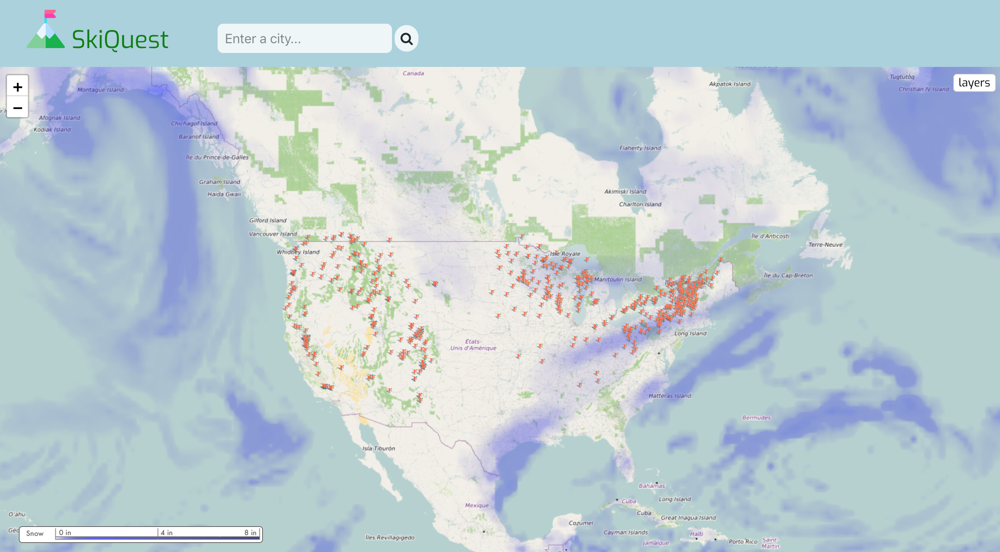
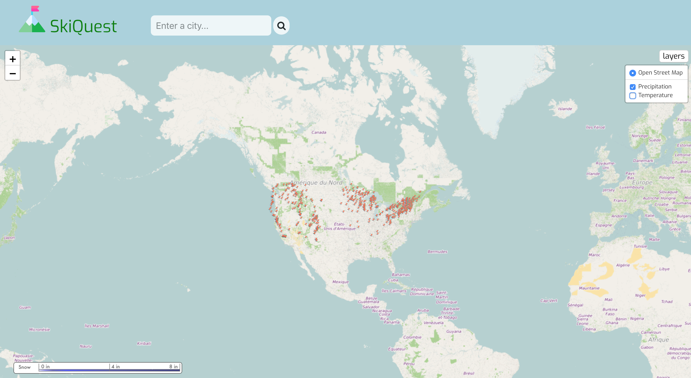
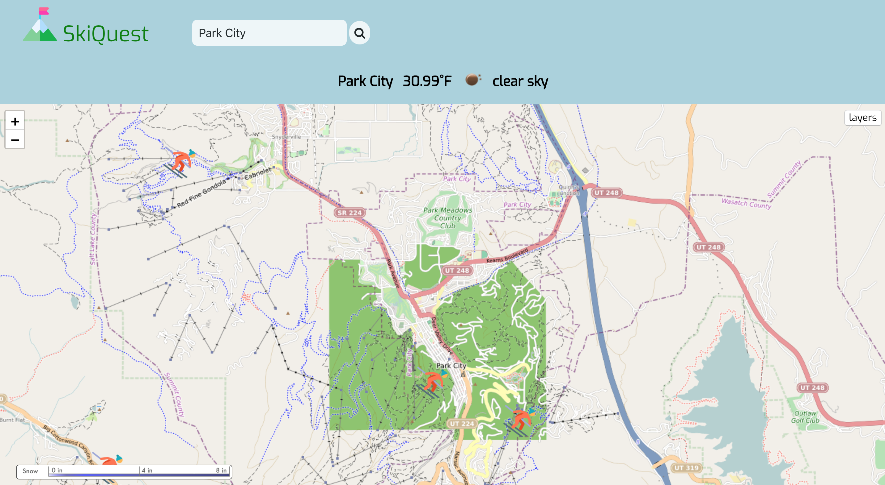
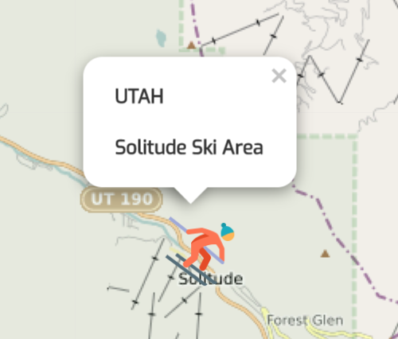
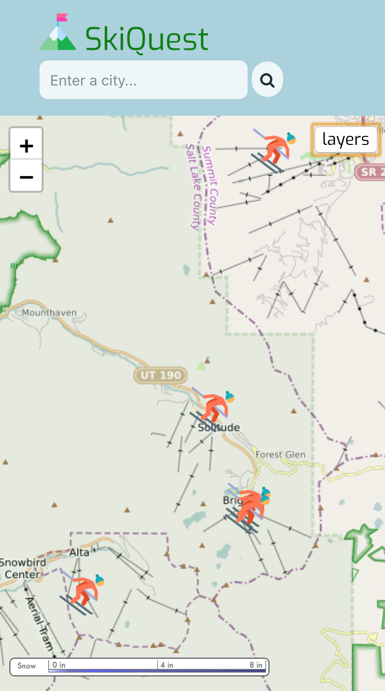

<!-- # initial wireframe 
https://drive.google.com/open?id=10iUIZDggn0n7-Qw6DhyseUxfAb6xqIHL
-->

## SkiQuest Weather App

Weather driven app allows users to discover new ski locations and search a city or click on a ski resort icon to determine if it's a good day to go skiing based on weather conditions.  A map allows the user to visualize current temperature and precipitation levels to see how large a storm is and the amount of snowfall.  

A ski area layer was also added as a geoJSON to allow the user to discover new ski areas.  

## Demo

- [Live Demo](https://alexmccomb.github.io/ski-weather-quest/)

## Screenshots
Main Page:

Layers Control:

Location Search Results:

Weather Results and Map Zoom:

Icon and Popup:

Mobile Version:

## Built with

The OpenWeatherMap and Nominatim reverse geocoder API, HTML, CSS, Leaflet, JavaScript, jQuery, geoJSON, and AJAX. 
